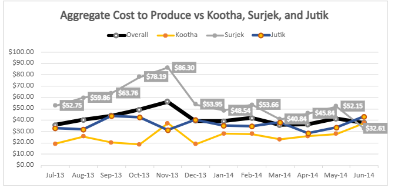
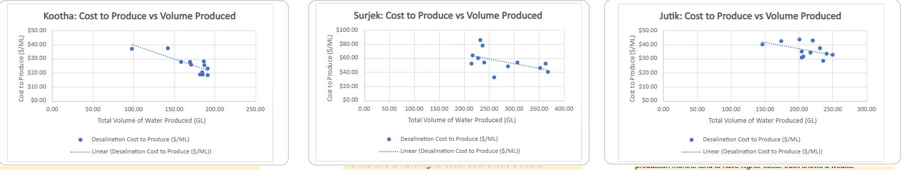
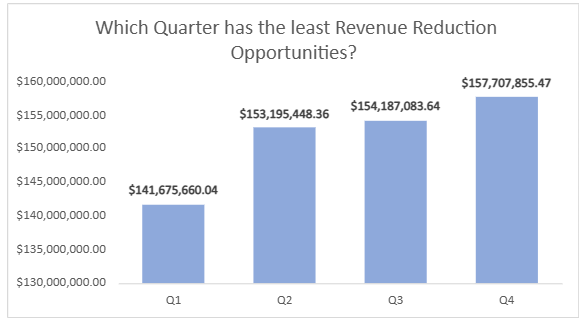

# Southern Water Economic Analysis

## Project Overview

This Excel-based case study analyzes economic and operational data for Southern Water Corp. The project explores water-market behavior, production costs, profitability, and maintenance planning to support data-informed business decisions.

The analysis combines financial, production, and market data to evaluate business performance and identify patterns that can support operational planning.

## Business Questions

This project explores several business questions, including:

- How do changes in water-market price relate to market demand?
- Which desalination facilities operate most cost-effectively?
- How do production costs and profitability vary across facilities?
- How can historical market patterns support maintenance-planning decisions?

## Tools Used

- Microsoft Excel
- Excel formulas and functions
- Pivot tables
- Data visualization
- Variance analysis
- What-if analysis

## Analysis

The workbook includes several stages of analysis, including:

### Market Analysis
Examined historical market pricing and demand patterns to evaluate market behavior and identify economic trends.

### Production Cost Analysis
Compared operational and production costs across desalination facilities to evaluate relative cost efficiency.

### Profitability Analysis
Analyzed financial performance and operating results to better understand differences across facilities.

### What-If Analysis
Used historical market data to evaluate potential maintenance timing and support business-planning decisions.

## Project Highlights

### Production Cost Trends

The analysis compared aggregate cost to produce with the performance of the Kootha, Surjek, and Jutik desalination facilities across the observed period. The visualization highlights substantial variation between facilities, including periods of elevated production cost that warranted deeper investigation.

### Production Volume and Cost

Scatter plots were used to examine the relationship between total water production volume and cost per megaliter for each desalination facility. The trend lines provide a visual comparison of how production scale relates to cost behavior across Kootha, Surjek, and Jutik.

### Maintenance What-If Analysis

A what-if analysis compared quarterly revenue outcomes to support maintenance-planning decisions. Among the scenarios evaluated, Q4 showed the highest projected revenue at approximately $157.7 million, while Q1 showed the lowest at approximately $141.7 million.

## Skills Demonstrated

- Data cleaning and organization
- Excel formulas and calculations
- Pivot-table analysis
- Economic data analysis
- Data visualization
- Business problem solving
- Scenario analysis
- Translating analytical findings into business recommendations

## Project Files

A portfolio version of the Excel workbook and selected analysis visuals will be included in this repository.

## About This Project

This project was completed as part of my Data Analytics Career Program coursework and has been adapted for portfolio presentation.
